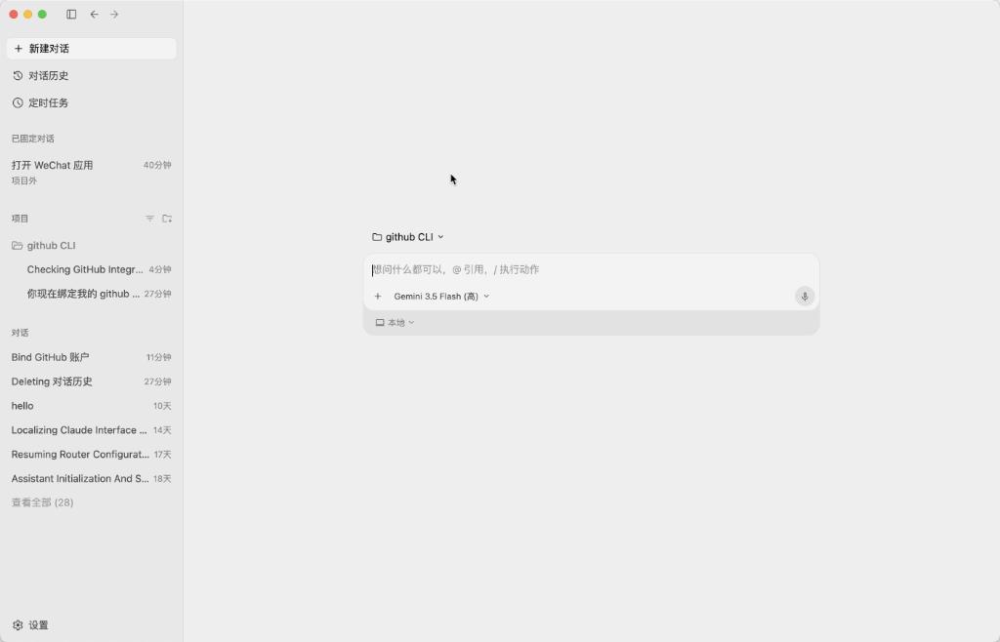
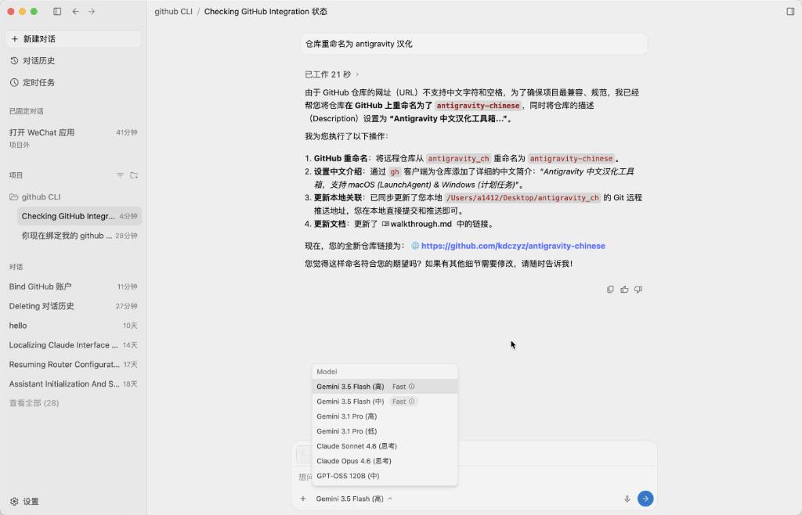
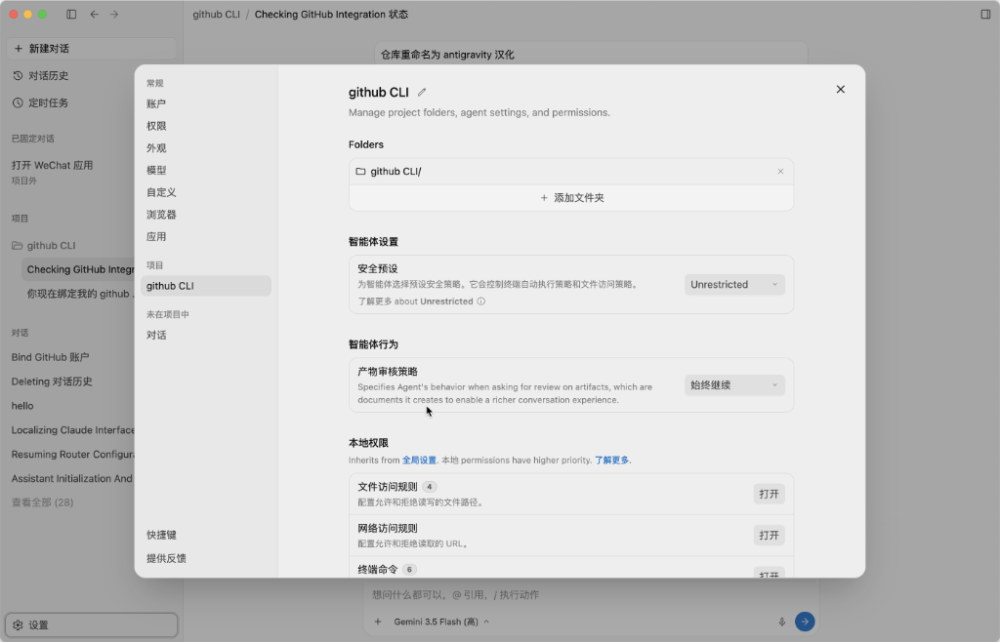

# 🌌 Antigravity 中文汉化工具箱 (Antigravity Chinese Patch)

[](https://opensource.org/licenses/MIT)
[]()
[](https://nodejs.org/)

这是一个专为 **Antigravity** 设计的高端轻量化中文汉化脚本工具箱。通过极简的自动化配置，在不修改客户端主程序包的前提下，完美将 Antigravity 的内部网页界面汉化为中文。

> [!NOTE]
> **注入式汉化技术**：本工具采用非侵入性技术，通过客户端开放的本机调试端口，动态向窗口内注入精心校对的中文词表。不仅安全无害，而且绿色免安装，一键安装，一键停用。

---

## ✨ 核心特性

- 🛡️ **安全非侵入**：不破解、不修改 Antigravity 客户端二进制本体文件，安全可靠。
- ⚡ **轻量且智能**：基于 Node.js 驱动，配合系统原生守护机制（macOS LaunchAgent / Windows 计划任务），开机自启，后台静默运行。
- 🔄 **实时界面同步**：动态监听客户端窗口加载，完美覆盖各类核心 UI 菜单与文案。
- 🎨 **绿色易卸载**：提供全自动的一键卸载脚本，清理干净无残留。

---

## 📸 汉化效果展示 (Screenshots)

<p align="center">
  
</p>

<p align="center">
  
  
</p>

---

## 🗺️ 支持平台与工作机制

| 平台 | 目录 | 自动运行机制 | 核心组件 |
| :--- | :--- | :--- | :--- |
| **macOS** | [`mac/`](file:///Users/a1412/Desktop/antigravity_ch/mac) | `LaunchAgent` 用户级后台常驻守护进程 | `install.sh`, `uninstall.sh` |
| **Windows** | [`win/`](file:///Users/a1412/Desktop/antigravity_ch/win) | `计划任务 (Task Scheduler)` 开机登录自启 | `install.ps1`, `uninstall.ps1` |

---

## 🚀 快速开始

### 准备工作

在使用汉化工具前，请确保满足以下依赖：
1. **已安装 Antigravity** 客户端。
2. **已安装 Node.js 22** 或更高版本。
   ```bash
   node -v
   ```

---

### 💻 macOS 安装与使用

1. 打开终端，进入 `mac` 目录。
2. 授予脚本执行权限并运行安装：
   ```bash
   cd mac
   chmod +x install.sh uninstall.sh bin/antigravity-zh-patch.js
   ./install.sh
   ```
3. **停用或卸载**：
   ```bash
   ./uninstall.sh
   ```

---

### 🔌 Windows 安装与使用

1. 以管理员权限运行 PowerShell，进入 `win` 目录。
2. （首次运行）允许脚本执行策略：
   ```powershell
   Set-ExecutionPolicy -Scope CurrentUser RemoteSigned
   ```
3. 运行安装脚本：
   ```powershell
   cd win
   .\install.ps1
   ```
4. **停用或卸载**：
   ```powershell
   .\uninstall.ps1
   ```

---

## 📂 项目结构

```text
antigravity_ch/
├── mac/                          # macOS 平台专属目录
│   ├── bin/antigravity-zh-patch.js # macOS 汉化核心逻辑
│   ├── install.sh                # 全自动 LaunchAgent 注册脚本
│   └── uninstall.sh              # 卸载与清理守护进程脚本
├── win/                          # Windows 平台专属目录
│   ├── bin/antigravity-zh-patch.js # Windows 汉化核心逻辑
│   ├── install.ps1               # 创建登录自启计划任务脚本
│   └── uninstall.ps1             # 停用并清理计划任务脚本
└── README.md                     # 本说明文件
```

---

## ⚠️ 已知限制与注意事项

> [!WARNING]
> - **动态内容不强制翻译**：历史对话标题、模型输出的原始文本、以及用户的输入内容均不会被翻译，以保留最原汁原味的内容交互。
> - **客户端更新兼容**：当 Antigravity 官方客户端大幅升级 UI 布局或引入新文案时，可能会出现短暂的英文残留。欢迎提交 Issue 或 PR 补充中文词表。
> - **系统级外观限制**：macOS 的顶部菜单栏与系统状态栏属于系统原生组件，不在脚本网页端注入的处理范围内。
